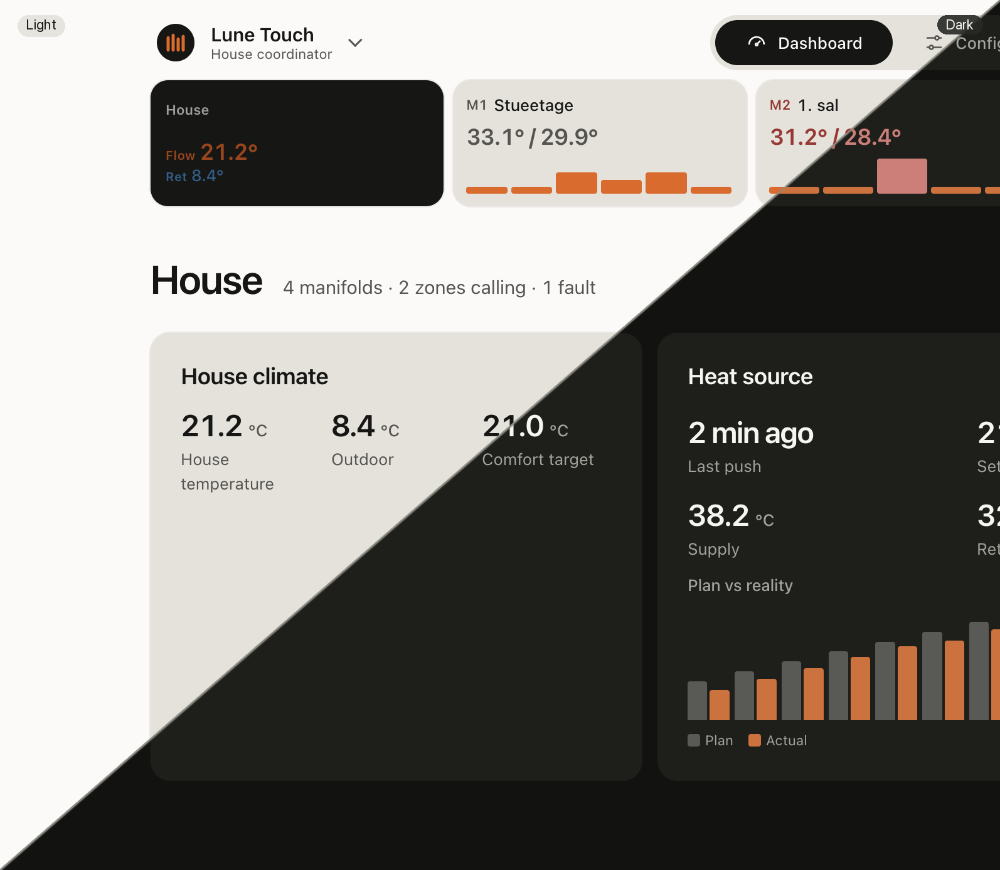

# Lune Touch / Mini

House coordinator for one or more [Lune V6](https://github.com/Birkemosen/lune)
manifold boards. **Lune Touch** is the 7-inch ESP32-S3 wall unit with LVGL and a
local web dashboard; **Lune Mini** is the same coordinator without a display.



## Firmware

Active entrypoints (standalone checkout):

```text
configurations/lune-touch-7.yaml   # Touch — Waveshare ESP32-S3-Touch-LCD-7B
configurations/lune-mini.yaml      # Mini — headless, no LVGL package
```

Shared stack: custom 16 MB OTA partitions, network/OTA/safe mode, USB serial
provisioning, diagnostics, `lune_touch_coordinator`, Touch API, and the embedded
web UI. Touch adds LCD/LVGL; Mini omits the display package.

Hardware profile: Waveshare ESP32-S3-Touch-LCD-7B, 1024×600 RGB565, GT911 touch,
CH422G panel power/reset. LCD timings and buffer rules live in
`docs/LCD_STABILITY.md`; field checks in `docs/field_validation.md`.

```bash
make config
make build
make deploy HOST=192.168.x.x
make config-mini
make build-mini
make deploy-mini HOST=192.168.x.x
make test
```

`make build` / `make deploy` append a development suffix (`v0.1.0-1`, …). Release
builds drop it:

```bash
make release
make release VERSION=v1.0.0
make release-deploy HOST=192.168.x.x
make release-mini
```

`make build-verify` compiles without touching `version.yaml`. Firmware is checked
against the 0x640000 OTA slot in `partitions/lune_touch_16mb_ota.csv`.

## Web dashboard

The on-device dashboard is **Lune Design System 2** — tokens and components in
`web/design-system/`, pages and i18n in `web/touch-ui/`. Firmware serves the gzip
bundle from `packages/dashboard/` (`/`, `/en/`, `/da/`, plus `/api/lune-touch/v1/*`).

```bash
make touch-ui
# open web/_preview.html or web/touch-ui/dist/preview-en.html
```

Design changes land first in the sibling
[`lune-design-system`](https://github.com/Birkemosen/lune-design-system) repo,
then sync into `web/design-system/`. Agent rules: `AGENTS.md` and
`web/design-system/DESIGN.md`.

## Wall display (LVGL)

Touch UI screens, theme, and mockups are documented under `docs/display/`.
LVGL tokens still come from the sibling [`lds`](https://github.com/Birkemosen/lds)
repo until that path migrates:

```bash
# clone ../lds next to this repo
make design-tokens
make design-verify
```

## Ownership boundary

**Coordinator-owned:** weather fetch/cache; wind/solar/thermal-lead model;
house-wide preload across V6 nodes; adaptive learning and zone priority; comfort
bias folded into strategy before V6 commands; persisted per-zone learning
signals; command ledger (source, reason, requested/accepted value, expiry, clamp).

**Lune V6-owned:** motors and endstops; local temperature freshness; conservative
control without a coordinator; minimum flow; command validation/clamp/expiry;
snapshot/diagnostics API.

See also `docs/lune_brand_architecture.md`, `docs/api_v1.md`, and
`docs/forecast_preload.md`.

## Bringup note

Pinout and panel bring-up are settled. Treat changes to LCD timings, LVGL
buffers, HTTPS forecast behavior, dashboard bundle size, or poll cadence as
field-sensitive — re-run `docs/field_validation.md` before trusting a flashed
build.

## License

[GPL-3.0-or-later](LICENSE). The firmware is built on ESPHome, whose runtime is GPLv3;
`components/rpi_dpi_rgb/` is a local override derived from ESPHome's own component.
Third-party files keep their own licenses.

"Lune" and "Lune Touch" identify this project. Forks must use a different name and must
not be presented as Lune or as endorsed by this project.

## Support the project

Lune is developed in spare time and paid for out of pocket. If it heats your home and you
want to give something back, you can sponsor it through
[GitHub Sponsors](https://github.com/sponsors/Birkemosen).
